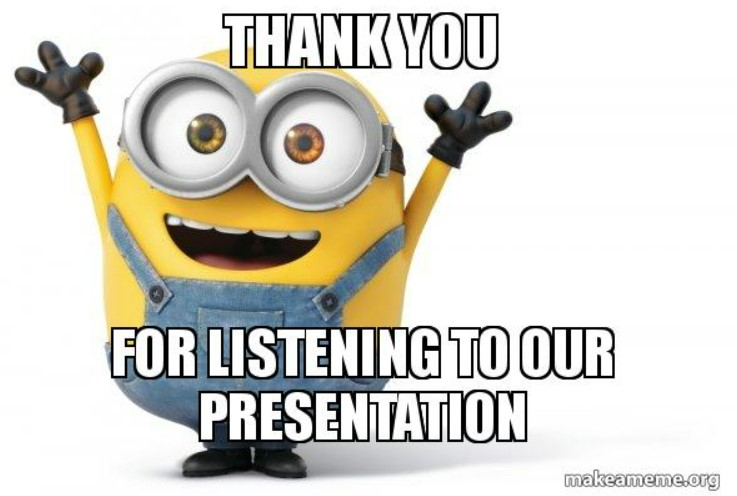

```{r load-packages, include = FALSE}
# Add any additional packages you need to this chunk
library(tidyverse)
library(palmerpenguins)
library(knitr)
library(xaringanthemer)
library(ggplot2)
```

```{r setup, include=FALSE}
# For better figure resolution
knitr::opts_chunk$set(fig.retina = 3, dpi = 300, fig.width = 6, fig.asp = 0.618, out.width = "80%")
```

```{r load-data, include=FALSE}
# Load your data here
twitchdata <- read.csv("twitchdata-update.csv")
```

```{r include=FALSE}
style_xaringan(
  title_slide_background_image = "img/confetti.jpg"
)
```

class: center, middle

## How stream time affects watch time and followers gained.

---

class: inverse, center, middle

# Introduction

---

# Research Question and Data

- How does stream time affect watch time and followers gained?

- This data was found through Awesome Public Datasets and was downloaded from Kaggle.com .

- There are `r nrow(twitchdata)` different entries and `r ncol(twitchdata)` different variables.


---

class: inverse, middle, center

# Analysis Plan

---

# Important Variables

- Channel, Nominal Categorical Variable 

- Stream Time, Discrete Numerical Variable

- Watch Time, Discrete Numerical Variable 

- Followers Gained, Discrete Numerical Variable

--


---

# Comparisons


.pull-left[
- To begin with we will compare Stream time with watch time.
- Then stream time with the number of followers gained.
]
.pull-right[
After this we want to look closer at whether or not other variables are affecting this result
Such as:
- What language the streamers speak
- Whether or not they are considered a mature streamer.
- To do this we will look at corilations between these variables and stream time.
]


---

# Prelim data analysis (stats etc.)

.pull-left[
- Some languages are more popular, language may have an effect on the number of views
- May need to try averages per language, or try to summerise data for followers gained (maybe as a percentage)
]
.pull-right[
```{r warning=FALSE, out.width="100%", fig.width=4, echo=FALSE}
# see how I changed out.width and fig.width from defaults
# to make the figure bigger
ggplot(twitchdata, 
       aes(y = Language,
           fill = Language)) +
  geom_bar() +
  theme_minimal()
```
]
---

# Important Stats

```{r recode-species, echo = FALSE}
# In this chunk I'm doing a bunch of analysis that I don't want to present 
# in my slides. But I need the resulting data frame for a plot I want to present.
twitchdata <- mutate(twitchdata,
                     Gain.percent = 100*Followers.gained/(Followers-Followers.gained))
language_data <- count(twitchdata, Language, sort= TRUE)
```
---
```{r plot-data, echo = FALSE, warning=FALSE}
# Code hidden with echo = FALSE
# Uses modified iris dataset from previous chunk
# Play around with height and width until you're happy with the look
twitchdata %>%
  filter(Language == "English") %>%
 filter(Gain.percent < quantile(Gain.percent, 0.75) &
         Gain.percent > quantile(Gain.percent, 0.25)) %>%
  ggplot(mapping = aes(x = log(Stream.time.minutes.), 
                       y = log(Watch.time.Minutes.))) +
                 geom_point() + 
                 labs (title = "Stream Time to Followers Gained",
                       x = "ln Stream Time (min)",
                       y = "ln Watch Time (min)") +
          geom_smooth() # theme options: https://ggplot2.tidyverse.org/reference/ggtheme.html
```

---

## Results needed to support hypothesis

```{r warning=FALSE, out.width="100%", fig.width=4, echo=FALSE}
# see how I changed out.width and fig.width from defaults
# to make the figure bigger

plug <- as.data.frame(twitchdata)

ggplot(
      mapping = aes( x = c(2, 4, 6, 8, 10, 12, 14, 16, 18, 20, 22, 24, 26, 28, 30),
                     y = c(5, 10, 15, 20, 25, 30, 35, 40, 45, 50, 55, 60, 60, 55, 50))) +
    geom_point() +
    labs(title = "Stream Time to Watch Time",
          x = "Stream Time/per Minute (10^6)",
          y = "Stream Time/per Minute (10^8)")
```

---

# 

```{r castle, echo = FALSE, out.width = "60%", fig.align = "center", fig.cap = "Image credit: Making a meme [Online] url: https://makeameme.org/meme/thank-you-for-tixmu6 (Acessed 28/10/2022)."}

```


